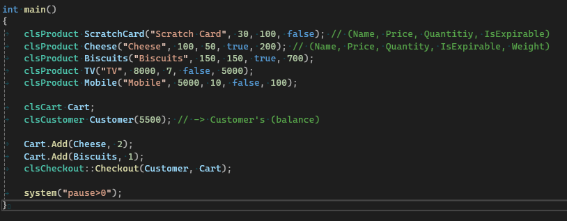
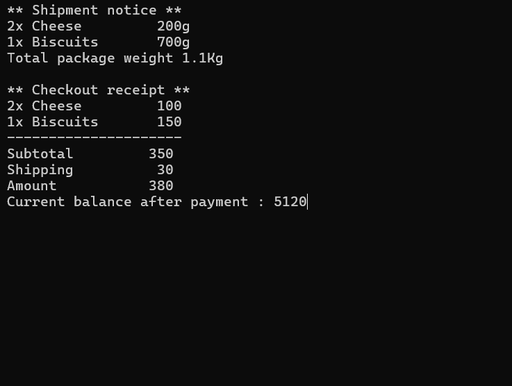
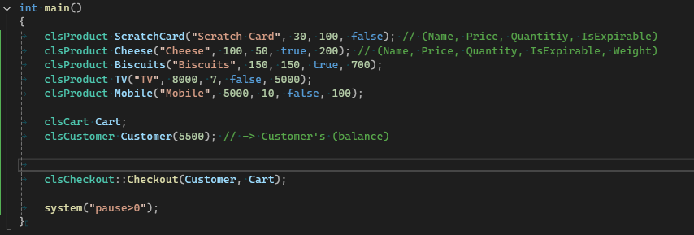
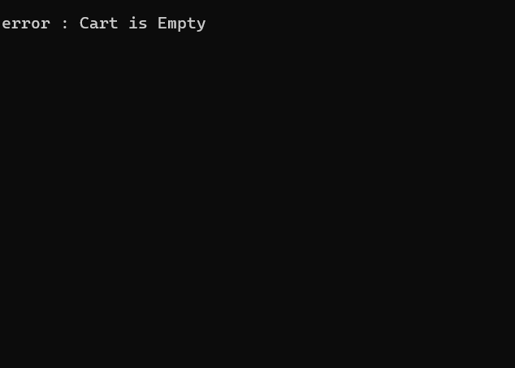
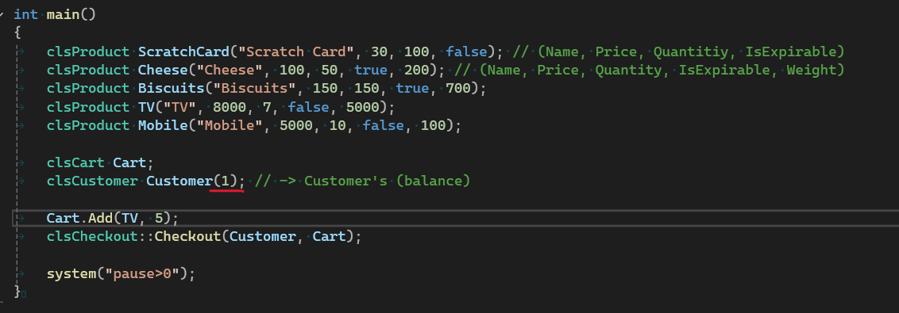
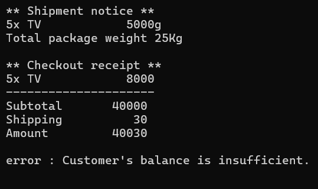
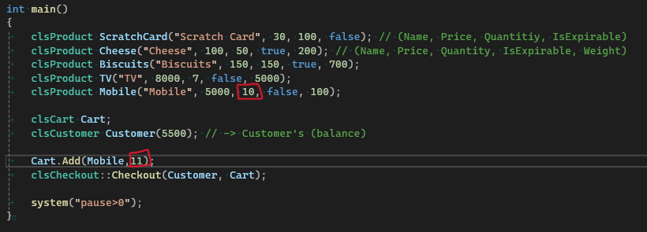
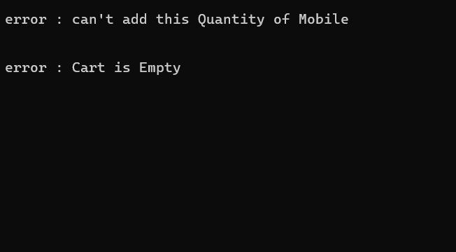
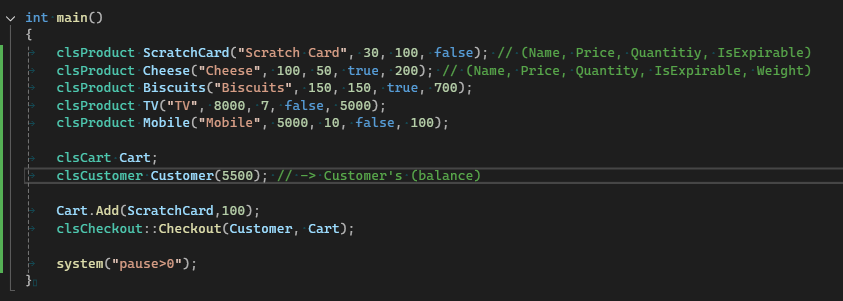
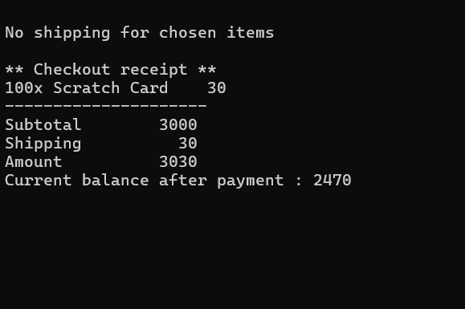

# Fawry-Quantum-Internship-Challenge
### This is an object-oriented project that simulates a basic e-commerce checkout system.
---

##  Table of Contents

- [Test Cases](#test-cases)
  - [Successful Payment](#successful-payment)
  - [Empty Cart](#empty-cart)
  - [Insufficient Balance](#insufficient-balance)
  - [Product Out of Stock](#product-out-of-stock)
  - [Checkout Non-Shippable Product](#checkout-non-shippable-product)

---

## Test Cases

### Successful Payment
  
  

---
  
### Empty Cart
  
  

---

### Insufficient Balance
  
  

---

### Product Out of Stock
  
  

---

### Checkout Non-Shippable Product
  
  

